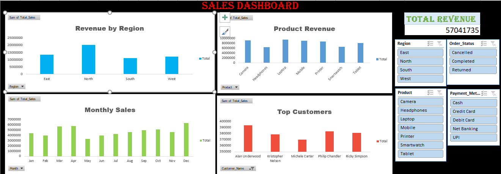

# 📊 Sales Dashboard using Excel

This is my first data analytics project where I created a sales dashboard using Excel.

---

## 🧾 About the Project

I worked on a sales dataset with around 500+ records and tried to analyze it like a real business problem.

I created an interactive dashboard to understand:
- Sales performance by region  
- Product-wise revenue  
- Monthly sales trends  
- Top customers  

---

## 🎯 Objective

The goal of this project was:
- To practice Excel for data analysis  
- To understand how to work with real-world data  
- To build a simple and interactive dashboard  

---

## 🛠️ Tools Used

- Microsoft Excel  
- Pivot Tables  
- Charts (Bar, Column)  
- Slicers  
- Basic Data Cleaning  

---

## 📈 Key Insights

- North region generates the highest revenue  
- Laptop and Camera are top-performing products  
- Sales vary across different months  
- A small number of customers contribute more revenue  

---

## 💡 What I Learned

- How to clean and prepare data  
- How to use Pivot Tables for analysis  
- How to create an interactive dashboard  
- How to think about data from a business perspective  

---

## 📷 Dashboard Preview

---

## 🚀 Future Improvements

- Improve dashboard design  
- Perform deeper data analysis  
- Learn advanced tools like SQL and Power BI  

---

## About Me

I am a beginner learning Data Analytics and building projects step by step.
